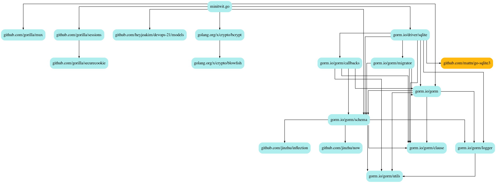

# DevOps, Software Evolution and Software Maintenance

*Joakim Hey Hinnerskov (jhhi), Ask Harup Sejsbo (asse), Kasper Olsen (kols), Petya Buchkova (pebu), Thomas Tyge Andersen (thta) and Magnus Johannsen (magjo)*

## Dependencies
### Libraries
> Table only lists direct dependencies. Verbose dependency graph can be found [here](assets/dep_app_simple.png).

| **Dependency**                | **Version**                        	| **Description**                                    	|
|-----------------------------	|------------------------------------	|----------------------------------------------------	|
| github.com/gorilla/mux      	| 1.8.0                              	| Framework for HTTP request handling.               	|
| github.com/gorilla/sessions 	| 1.2.1                              	| Provides access to read and write session cookies. 	|
| github.com/mattn/go-sqlite3 	| 1.14.6                             	| Database driver for SQLite3.                       	|
| gorm.io/gorm               	| 1.20.12                           	| ORM for Go.                                        	|
| golang.org/x/crypto/bcrypt  	| v0.0.0-20201221181555-eec23a3978ad 	| Used to hash passwords and verify password hashes. 	|

### Cloud dependencies
> These services are responsible for cloud hosting.

| **Service**          	| **Provider**        	| **Description**                   |
|------------------	    |-----------------	    |--------------------------------	|
| App Service      	    | Microsoft Azure 	    | Hosting of web application     	|
| Docker Container 	    | Docker          	    | Containerizing of applications 	|